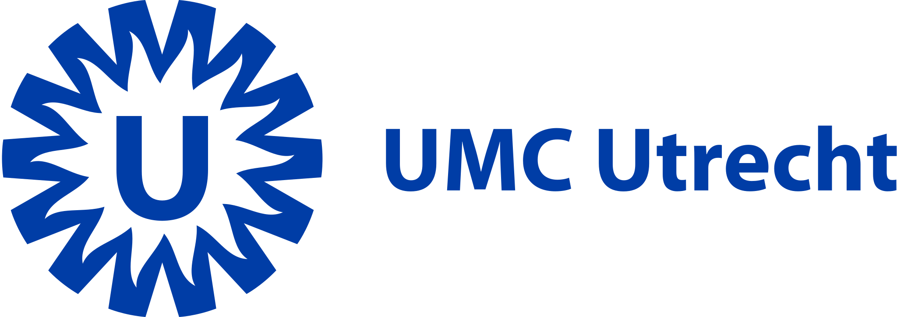

# Malin Overmars 👋🏼👩🏼‍💻 
**Postdoctoral Researcher**  
**University Medical Center Utrecht**

---

## About me

Hello! I'm **Malin Overmars**, a postdoctoral researcher at the **University Medical Center Utrecht**. I focus on **cardiovascular diseases**, combining my background in **data science** with my drive to improve patient outcomes.

During my PhD, I investigated and described the application of data science to various cardiovascular show cases in my dissertation, *"Big Data, Small Vessels"*. From predicting outcomes to extracting symptoms from clinical documents, my research aims to augment cardiovascular health with data as a foundation.

In my view, interdisciplinary collaboration is indispensable in our field; I am energized by collaborations with clinicians, other data scientists, laboratory specialists, and data managers, among others, to achieve clinically relevant outcomes together.
---

## What I am working on

Research topics:

- **Symptom Extraction**: Using natural language processing (NLP) and Named Entity Recognition and Linking (NER+L) to extract symptoms from clinical documents and analyze symptom patterns 📑.
- **Proteomics**: Cluster-based analyses using a panel of 92 plasma proteins to unravel the pathophysiology of cerebral small vessel disease 🧠. 
- **Prediction Modeling**: Building machine-learning models to rule out coronary artery disease in patients with stable chest discomfort symptoms 🫀.  
- **Sex Differences**: I consider male/female differences in cardiovascular disease by default and stratify by sex whenever possible 👩🏻‍🤝‍👨🏿.

---

## Feel free to get in touch!
- **Email**: l.m.overmars-2@umcutrecht.nl
- **LinkedIn**: https://www.linkedin.com/in/malin-overmars/

Thanks for visiting my page, and let's keep making an impact! 🌟
